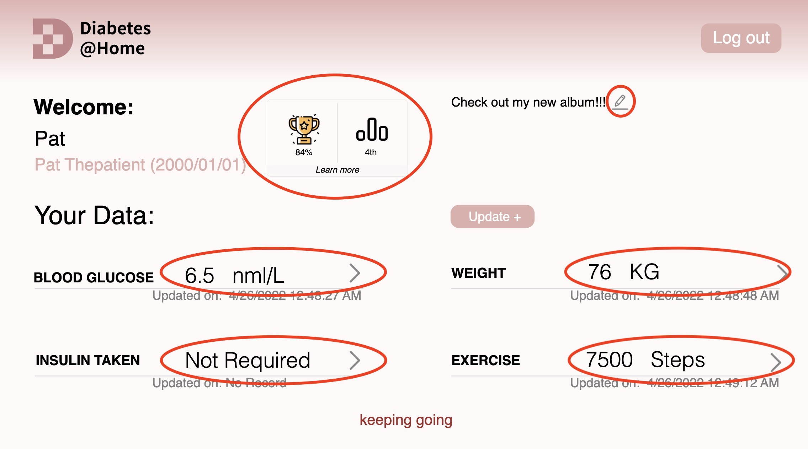
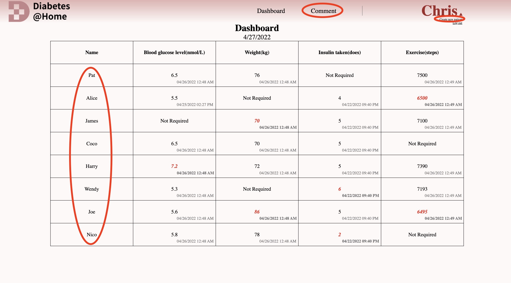
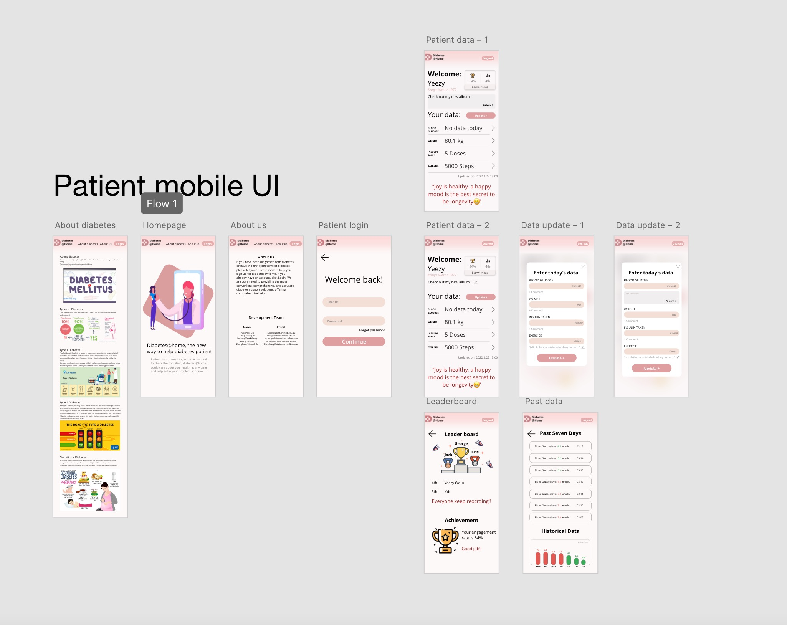
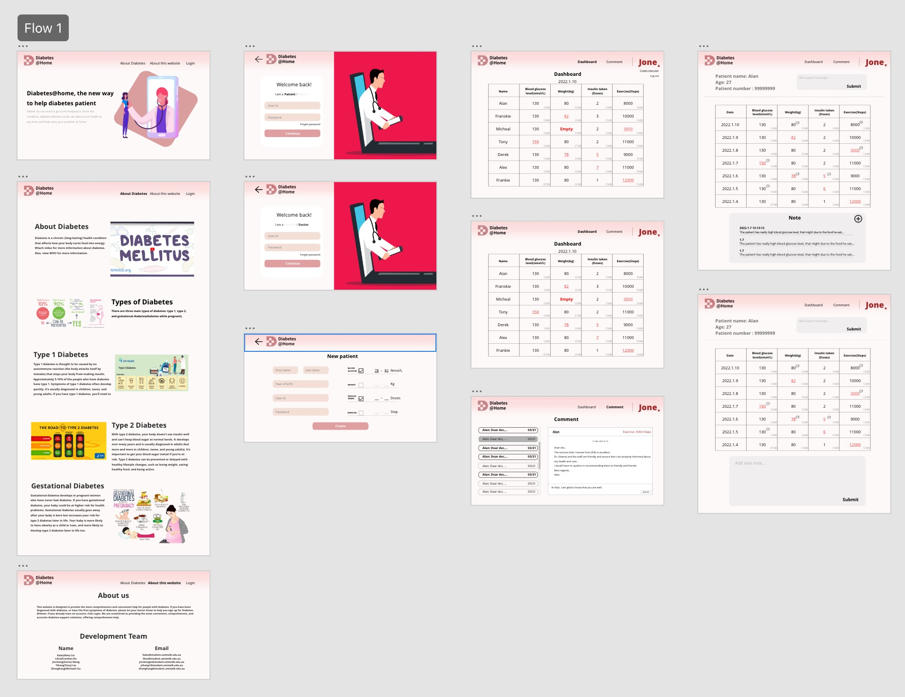

# INFO30005-assignment
Repository for INFO30005 group project 

## Deliverable 2:

### Tutorial: 

Tutorial T8, Thursday 6:15 pm Tutor: Dekko Shi

### Fake data description:

#### Safety threshold:

We manually set safety threshold for Pat as below. Please note we set Insulin Taken as Not Required Data for Pat. [check this](#Page for patient upload data)

```
Blood Glucose : 3.9 - 6.1
weight: 75 - 80
Insulin Taken: Not Required 
exercise: 7000 - 8000
```

So, if Pat Blood Glucose data is <= 3.9 or >= 6.1, the Blood Glucose field will be highlighted to red in clinician Chris's dashboard page.

#### Other patient in dashboard page:

Except Pat, the rest patients in dashboard is fake data, only for display purpose, no really meanning.

### Functionalities implemented but not required for Deliverable2:

#### Login page for patient:

For the [Login](https://diabetesathome-4399.herokuapp.com/login) we only implemented for patient Pat at this stage.

User id: Pat.ThePatient@demo.com 

Password: Abcd1234

For the Password filed, we have not implement authentication via Passport yet

#### Page for patient upload data:

We set patient Pat's **Insulin Taken** as not required for functionality testing purpose. In addition to **Insulin Taken**, Pat was free to update the remaining 3 data items and comments.

### Functionalities not implemented in Deliverable 2:

#### In patient side:

<p align="center">
  
</p>

In patient side, the function leaderboard and achievement which has been circled in red, we have designed it in deliverable 1 but not required in deliverable 2, we have not implemented it yet.

If click on the data which have been circled in red, patient should be able to look at the past data. It is not required in deliverable 2, so we have not implemented it yet.

#### In clinician side:

<p align="center">
  
</p>

In clinician side, the functions comment and create new user which have been circled in red are designed  in the deliverable 1, but because there is no requirement in deliverable 2, we have not implemented them yet.

If click on the patient name which have also been circled in red, it should be jumped into patient information page. This is not required in deliverable 2, so we have not implemented yet.

### Directory structure:

```
INFO30005-assignment
├─ app.js
├─ controller
│  ├─ clinicianController.js
│  ├─ loginController.js
│  ├─ patientController.js
│  └─ welcomeController.js
├─ helper
│  └─ hbsHelper.js
├─ models
│  ├─ clinician.js
│  ├─ data.js
│  ├─ index.js
│  └─ patient.js
├─ public
│  ├─ css
│  │  ├─ dashboard.css
│  │  ├─ login.css
│  │  ├─ patientInfo.css
│  │  └─ stylesheet.css
│  ├─ js
│  │  ├─ dashboard.js
│  │  ├─ login.js
│  │  └─ patientData.js
│  └─ res
│     ├─ .DS_Store
│     ├─ arrow.png
│     ├─ blur.jpeg
│     ├─ cancel.jpg
│     ├─ dia1.jpg
│     ├─ dia2.png
│     ├─ dia3.jpg
│     ├─ dia4.jpg
│     ├─ dia5.png
│     ├─ favicon.ico
│     ├─ Line.png
│     ├─ login.png
│     ├─ logo.jpeg
│     ├─ logo.png
│     ├─ pen.png
│     ├─ ranking.png
│     ├─ triangle.png
│     ├─ trophie.png
│     ├─ wel_pic-1.png
│     └─ wel_pic.png
├─ routes
│  ├─ clinicianRouter.js
│  ├─ loginRouter.js
│  ├─ patientRouter.js
│  └─ welcomeRouter.js
└─ views
   ├─ aboutDiabetes.hbs
   ├─ aboutThisWebsite.hbs
   ├─ clinician.hbs
   ├─ data.hbs
   ├─ layouts
   │  └─ main.hbs
   ├─ login.hbs
   └─ welcome.hbs
```


## Deliverable 1:

The HTML code is [here](https://github.com/yihangYH/INFO30005-assignment/tree/main/HTML) and the CSS code is [here](https://github.com/yihangYH/INFO30005-assignment/tree/main/css)

### Tutorial

Tutorial T8, Thursday 6:15 pm Tutor: Dekko Shi

### Links

Link to prototype (Phone size patient app):https://xd.adobe.com/view/4301ee10-beba-4f66-abba-0b595899353f-1652/

Link to second prototype (desktop size Clinician app):https://xd.adobe.com/view/aeebc65c-d20d-4a19-88e5-225d45f08e78-fbb8/

Link to HTML/CSS file: https://github.com/yihangYH/INFO30005-assignment

### Screenshot from XD: Patient app

<p align="center">
  
</p>

### Screenshot from XD: Clinician app

<p align="center">
  
</p>

### Important Note:

All HTML and CSS work fine in Chrome devtools, but Safari devtool may display errors.

Please use http or https as prefix when opening static pages, otherwise Youtube videos **About diabetes** will not appear.

If the Youtube video does not load, please refresh the page.

For mobile sizes, if you view from XD or Chrome Devtool, you may find that the text is too small, please enlarge it. On actual mobile devices, all text font sizes are displayed normally.

## Group member:

**Student Name           Student ID    Student Email** 

Kaixi(Alex) Liu            1073975       [liuka@student.unimelb.edu.au](mailto:liuka@student.unimelb.edu.au)

Zhonghang(Michael) Gu    1047854       [zhonghang@student.unimelb.edu.au](mailto:zhonghang@student.unimelb.edu.au)

Yihang(Tony) Liu          1061578       [yihang1@student.unimelb.edu.au](mailto:yihang1@student.unimelb.edu.au)

Jincheng(Derex) Wang     1025060       [jinchengw@student.unimelb.edu.au](mailto:jinchengw@student.unimelb.edu.au)

Lihui(Frankie) Hu         1074459       lihui@student.unimelb.edu.au

## Assignment requirement：

in the shared google doc:

https://docs.google.com/document/d/1ZUliPcTeukuZEbMJIu-g7KE2NAtpx09XQkbP0jxxtNw/edit

